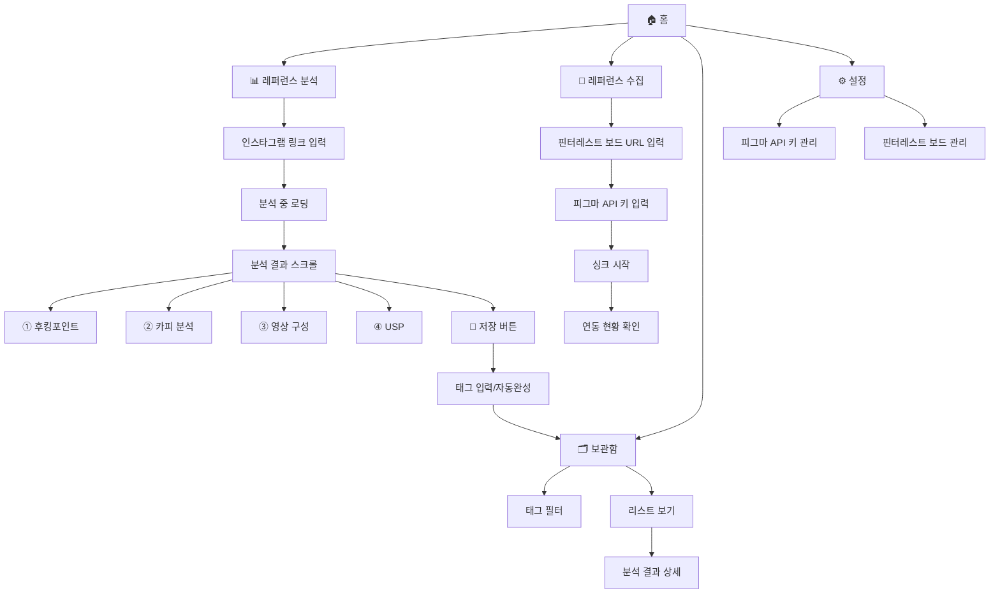

# 사이트 구조 (Sitemap)

## ASCII 다이어그램

```
레퍼런스랩 (ReferenceLab)
│
└── 🏠 홈
      ├── [레퍼런스 분석] 버튼
      │     │
      │     └── 📊 분석 화면
      │           ├── 인스타그램 링크 입력창
      │           ├── 분석 시작 버튼
      │           ├── 로딩 상태
      │           │
      │           └── 결과 (스크롤)
      │                 ├── ① 후킹포인트
      │                 ├── ② 카피 분석
      │                 ├── ③ 영상 구성 (장면별 흐름)
      │                 ├── ④ USP
      │                 └── 💾 저장 버튼
      │                         └── 태그 입력 (자동완성)
      │                               └── 보관함 저장 완료
      │
      ├── [레퍼런스 수집] 버튼
      │     │
      │     └── 📌 수집 화면 (핀터레스트→피그마)
      │           ├── 핀터레스트 공개 보드 URL 입력
      │           ├── 피그마 API 키 입력
      │           ├── 싱크 시작 버튼
      │           └── 연동 현황
      │                 ├── 연동된 보드 목록
      │                 └── 마지막 싱크 시간
      │
      ├── 🗂 보관함
      │     ├── 태그 필터 (상단 가로 스크롤)
      │     └── 리스트
      │           └── [썸네일 + 분석 요약]
      │                 └── 클릭 → 분석 결과 상세
      │
      └── ⚙️ 설정
            ├── 피그마 API 키 관리
            └── 연동된 핀터레스트 보드 관리
```

---

## Mermaid 다이어그램

> 👉 https://mermaid.live 에 아래 코드를 붙여넣으면 그래픽으로 볼 수 있어요!


